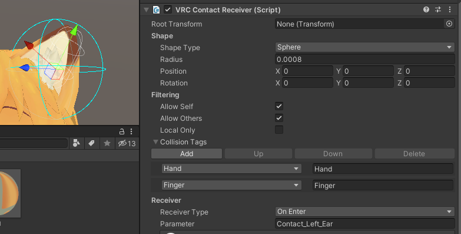

# HaptiConVRC

VRChatでアバターの接触イベントを検知して、Joy-Conを振動させるシステム

* 開発中バージョンのため不安定です。
* 現在は「ツンツン」動作のみ対応しています。
    * **指定した空間に他者の手や指が入ったときにJoy-Conが振動する、という動作をします。**
    * 他の動作モードは開発中...
* [ライセンス](LICENSE)

# 必要なもの

* Joy-Con L または R
* PCVR環境(Windows10)
    * PCはBluetooth接続可能なこと
        * USBのBluetoothアダプタでも可

# 導入方法

1. Unityで、アバターの接触を検出したい部位（Armature）に `VRC Contact Receiver (Script)` を設定してください。
    
    * Shape : 任意の検出範囲
    * Filtering
        * Allow Self と Allow Others にチェックを入れることを推奨
        * Collision Tags : Hand と Finger を推奨
    * Receiver
        * Receiver Type : `On Enter` （将来的に他のタイプもサポート予定）
        * Parameter : わかりやすいパラメータ名を設定する。（例：右耳なら `Contact_Left_Ear` ）
1. PCにPythonをインストールする。
    * インストール時、 `Add Python3.x to PATH` にチェックを入れてください。
1. HaptiConVRCのzipをダウンロードし、展開する。
    * [最新版リンク](https://github.com/aruma256/HaptiConVRC/archive/refs/heads/main.zip)
1. 展開したフォルダの `setup.py` を実行する。
    * 必須ライブラリを自動インストールします。
1. `config.json` をメモ帳などで開き、Joy-Conと連携させるContact Receiverのパラメータ名（ステップ1で作成したもの）を設定する。
    * 例 : `Contact_Left_Ear`
    * Joy-Conの片方のみ使う場合、使わないほうのパラメータ名は空欄 `""` にしてください。
1. Joy-ConをPCに接続する。
    * Joy-ConをSwitch本体から取り外し、ペアリングボタンを長押しし、WindowsのBluetooth接続設定からペアリングをする
    * Switch本体つなげると、Joy-ConとSwitch本体が再ペアリングされます。
    * PC側にペアリング情報が残っていると、再ペアリングできません。その場合はPCでペアリング解除を行ってください。
1. `main.py` を実行する。

[#HaptiConVRC でツイートしてね](https://twitter.com/intent/tweet?text=%23HaptiConVRC)
